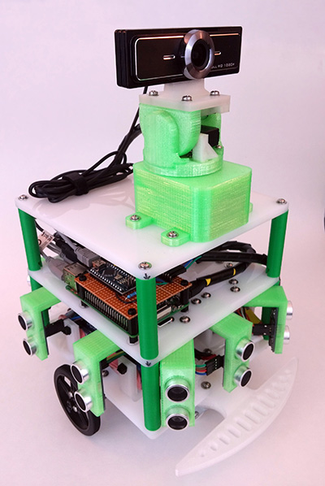

# Ansel Robotics Platform
Ansel is a robotics platform I'm developing to be used as a base for computer vision and machine learning experiments.

## Software Components
Currently, it consists of three main subsystems:

1. Motor Board: Arduino board controlling a dual H-Bridge driver and two DC motors in a differential drive configuration as well as the two servos making up the pan-tilt mount for the camera (See: https://github.com/crmaykish/drive-board)
2. Ultrasonic Sensor Board: ATmega1284p-based board dedicated to continuously reading the ten ultrsonic distance sensors and feeding the data back over serial (See: https://github.com/crmaykish/ultrasonic-sensor-board-10x)
3. Control: A Raspberry Pi 3 running Python to tie the other subsystems together and control the high level function. Also provides data logging and, eventually, computer vision and machine learning algorithms

## Electrical
Aside from the aforementioned Arduino and Raspberry Pi components, Ansel is powered by two 3000mAH NiMH battery packs in parallel.
The two motors get the raw the battery voltage and the rest of the components are powered by a low dropout linear regulator at 5v on a handmade board.

## Mechanical
Ansel sits atop two DC drive motors and two caster wheels. The chassis is a combination of 1/4" plexiglass sheets and 3D printed parts.

